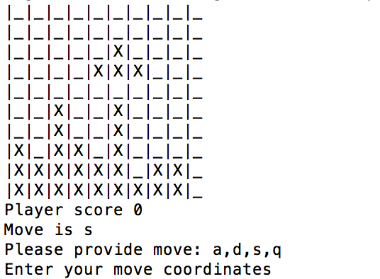

# Project Tetris CLI (Pair - programmed BETA)
========================

This command line Tetris game is the product of team effort via pair programming. This ruby game consists of moving blocks down, left and right as well as clockwise and counterclockwise rotation. The input in bash was made more 'realtime'. All pieces as well as the board are being printed in command line after every movement or deletion of completed row. This includes also basic score information.

* This is beta version still in progress!



## Getting Started

To play the game, please fire up the following command in bash (assuming you have ruby installed there ([Check how to instal](https://gorails.com/setup/osx/10.12-sierra)) )
```
$ ruby game.rb

```


## About the authors
[Dariusz Biskupski](http://dariuszbiskupski.com/)

[Andrea Asamoah](https://andieasamoah.wordpress.com/)

## Acknowledgments

This assignment was created for [Viking Code School](https://www.vikingcodeschool.com/)
